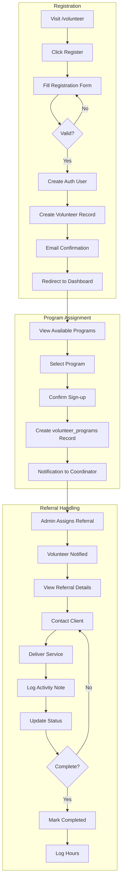
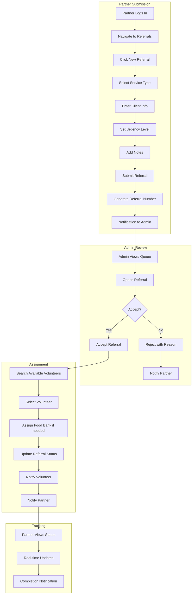
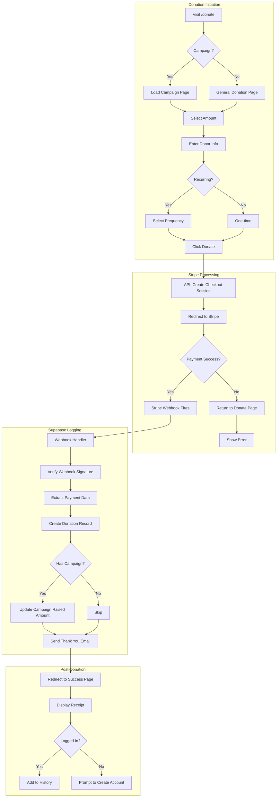

# Seed & Spoon NJ - Spec Kit Blueprint

> **Project**: Seed & Spoon NJ - Nonprofit CRM & Volunteer Management Platform
> **Version**: 1.0.0
> **Created**: 2026-01-12
> **Status**: Planning / Pre-Implementation

---

## Table of Contents

1. [Overview](#overview)
2. [Backend / Database Tables](#backend--database-tables)
3. [Frontend / Pages & Components](#frontend--pages--components)
4. [Workflows / User Flows](#workflows--user-flows)
5. [MCP Server Mapping](#mcp-server-mapping)
6. [Execution Checklist](#execution-checklist)

---

## Overview

### Mission
Seed & Spoon NJ is a nonprofit organization connecting volunteers, partners, and food banks to fight food insecurity in New Jersey. This platform serves as a CRM for managing volunteers, referrals, programs, donations, and client services.

### Tech Stack
- **Frontend**: Next.js 14+ (App Router), React 18, TypeScript
- **UI Components**: Shadcn/ui, Tailwind CSS
- **Backend**: Supabase (PostgreSQL, Auth, Storage, Edge Functions)
- **Payments**: Stripe
- **Deployment**: Vercel
- **Testing**: Playwright (future)

### User Roles
| Role | Description | Access Level |
|------|-------------|--------------|
| **Admin** | Full system access, manages all entities | Full CRUD on all tables |
| **Volunteer** | Registered helpers, assigned to programs | View programs, update own profile, log hours |
| **Partner** | Organizations submitting referrals | Create referrals, view own submissions |
| **Donor** | Financial supporters | Make donations, view donation history |
| **Client** | Service recipients | Limited access, view own case status |

### Board & Staff Roles
| Position | Description | Document Access | System Access |
|----------|-------------|-----------------|---------------|
| **Founder/President** | Organization founder with full authority | All documents | Full system access |
| **Vice President** | Second in command | Policy, minutes, playbooks | Admin dashboard |
| **Treasurer** | Financial oversight | Bank statements, accounting, financial reports | Financial reports, donations |
| **Secretary** | Records and documentation | Meeting minutes, admin docs, playbooks (edit) | Document management, Notion |
| **Board Member** | Voting board member | Meeting minutes, policies (read) | Board portal |
| **Staff** | Paid staff member | Role-specific documents | Role-specific access |

---

## Backend / Database Tables

### Existing Tables (Supabase)

#### 1. `volunteers`
```json
{
  "table_name": "volunteers",
  "status": "existing",
  "description": "Registered volunteer profiles",
  "columns": {
    "id": { "type": "uuid", "primary_key": true, "default": "gen_random_uuid()" },
    "user_id": { "type": "uuid", "foreign_key": "auth.users.id", "nullable": false },
    "first_name": { "type": "varchar(100)", "nullable": false },
    "last_name": { "type": "varchar(100)", "nullable": false },
    "email": { "type": "varchar(255)", "unique": true, "nullable": false },
    "phone": { "type": "varchar(20)", "nullable": true },
    "address": { "type": "text", "nullable": true },
    "city": { "type": "varchar(100)", "nullable": true },
    "state": { "type": "varchar(2)", "default": "'NJ'" },
    "zip_code": { "type": "varchar(10)", "nullable": true },
    "availability": { "type": "jsonb", "nullable": true, "note": "Days/times available" },
    "skills": { "type": "text[]", "nullable": true },
    "status": { "type": "varchar(20)", "default": "'pending'", "enum": ["pending", "active", "inactive", "suspended"] },
    "background_check_status": { "type": "varchar(20)", "default": "'not_started'" },
    "created_at": { "type": "timestamptz", "default": "now()" },
    "updated_at": { "type": "timestamptz", "default": "now()" }
  },
  "indexes": ["user_id", "email", "status"],
  "rls_policies": {
    "select": "Volunteers can view own profile; Admins can view all",
    "insert": "Authenticated users can create own profile",
    "update": "Volunteers can update own profile; Admins can update all",
    "delete": "Admins only"
  }
}
```

#### 2. `admin_users`
```json
{
  "table_name": "admin_users",
  "status": "existing",
  "description": "Administrative user accounts with elevated privileges",
  "columns": {
    "id": { "type": "uuid", "primary_key": true, "default": "gen_random_uuid()" },
    "user_id": { "type": "uuid", "foreign_key": "auth.users.id", "unique": true, "nullable": false },
    "role": { "type": "varchar(50)", "default": "'admin'", "enum": ["super_admin", "admin", "coordinator"] },
    "permissions": { "type": "jsonb", "nullable": true, "note": "Granular permission overrides" },
    "created_at": { "type": "timestamptz", "default": "now()" },
    "updated_at": { "type": "timestamptz", "default": "now()" }
  },
  "indexes": ["user_id", "role"],
  "rls_policies": {
    "select": "Admins only",
    "insert": "Super admins only",
    "update": "Super admins only",
    "delete": "Super admins only"
  }
}
```

#### 3. `donations`
```json
{
  "table_name": "donations",
  "status": "existing",
  "description": "Financial donation records linked to Stripe",
  "columns": {
    "id": { "type": "uuid", "primary_key": true, "default": "gen_random_uuid()" },
    "user_id": { "type": "uuid", "foreign_key": "auth.users.id", "nullable": true, "note": "Null for anonymous donations" },
    "stripe_payment_intent_id": { "type": "varchar(255)", "unique": true, "nullable": false },
    "stripe_customer_id": { "type": "varchar(255)", "nullable": true },
    "amount_cents": { "type": "integer", "nullable": false },
    "currency": { "type": "varchar(3)", "default": "'usd'" },
    "status": { "type": "varchar(20)", "enum": ["pending", "succeeded", "failed", "refunded"] },
    "donation_type": { "type": "varchar(20)", "enum": ["one_time", "recurring"] },
    "donor_name": { "type": "varchar(255)", "nullable": true },
    "donor_email": { "type": "varchar(255)", "nullable": true },
    "is_anonymous": { "type": "boolean", "default": false },
    "campaign_id": { "type": "uuid", "foreign_key": "campaigns.id", "nullable": true },
    "notes": { "type": "text", "nullable": true },
    "metadata": { "type": "jsonb", "nullable": true },
    "created_at": { "type": "timestamptz", "default": "now()" },
    "updated_at": { "type": "timestamptz", "default": "now()" }
  },
  "indexes": ["user_id", "stripe_payment_intent_id", "status", "created_at"],
  "rls_policies": {
    "select": "Donors can view own donations; Admins can view all",
    "insert": "Webhook/Edge function only (service role)",
    "update": "Service role only",
    "delete": "Disabled"
  }
}
```

#### 4. `food_banks`
```json
{
  "table_name": "food_banks",
  "status": "existing",
  "description": "Food bank/pantry locations and details",
  "columns": {
    "id": { "type": "uuid", "primary_key": true, "default": "gen_random_uuid()" },
    "name": { "type": "varchar(255)", "nullable": false },
    "address": { "type": "text", "nullable": false },
    "city": { "type": "varchar(100)", "nullable": false },
    "state": { "type": "varchar(2)", "default": "'NJ'" },
    "zip_code": { "type": "varchar(10)", "nullable": false },
    "latitude": { "type": "decimal(10,8)", "nullable": true },
    "longitude": { "type": "decimal(11,8)", "nullable": true },
    "phone": { "type": "varchar(20)", "nullable": true },
    "email": { "type": "varchar(255)", "nullable": true },
    "website": { "type": "varchar(255)", "nullable": true },
    "hours_of_operation": { "type": "jsonb", "nullable": true },
    "services_offered": { "type": "text[]", "nullable": true },
    "capacity": { "type": "integer", "nullable": true, "note": "Families served per week" },
    "is_active": { "type": "boolean", "default": true },
    "contact_person": { "type": "varchar(255)", "nullable": true },
    "notes": { "type": "text", "nullable": true },
    "created_at": { "type": "timestamptz", "default": "now()" },
    "updated_at": { "type": "timestamptz", "default": "now()" }
  },
  "indexes": ["city", "zip_code", "is_active"],
  "rls_policies": {
    "select": "Public read access",
    "insert": "Admins only",
    "update": "Admins only",
    "delete": "Admins only"
  }
}
```

#### 5. `services`
```json
{
  "table_name": "services",
  "status": "existing",
  "description": "Types of services offered by the organization",
  "columns": {
    "id": { "type": "uuid", "primary_key": true, "default": "gen_random_uuid()" },
    "name": { "type": "varchar(255)", "nullable": false },
    "description": { "type": "text", "nullable": true },
    "category": { "type": "varchar(100)", "nullable": true, "enum": ["food_distribution", "meal_delivery", "nutrition_education", "emergency_assistance", "other"] },
    "is_active": { "type": "boolean", "default": true },
    "eligibility_requirements": { "type": "text", "nullable": true },
    "created_at": { "type": "timestamptz", "default": "now()" },
    "updated_at": { "type": "timestamptz", "default": "now()" }
  },
  "indexes": ["category", "is_active"],
  "rls_policies": {
    "select": "Public read access",
    "insert": "Admins only",
    "update": "Admins only",
    "delete": "Admins only"
  }
}
```

#### 6. `hours` (Volunteer Hours)
```json
{
  "table_name": "hours",
  "status": "existing",
  "description": "Volunteer hour tracking and logging",
  "columns": {
    "id": { "type": "uuid", "primary_key": true, "default": "gen_random_uuid()" },
    "volunteer_id": { "type": "uuid", "foreign_key": "volunteers.id", "nullable": false },
    "program_id": { "type": "uuid", "foreign_key": "programs.id", "nullable": true },
    "date": { "type": "date", "nullable": false },
    "hours_worked": { "type": "decimal(4,2)", "nullable": false },
    "description": { "type": "text", "nullable": true },
    "status": { "type": "varchar(20)", "default": "'pending'", "enum": ["pending", "approved", "rejected"] },
    "approved_by": { "type": "uuid", "foreign_key": "admin_users.id", "nullable": true },
    "approved_at": { "type": "timestamptz", "nullable": true },
    "created_at": { "type": "timestamptz", "default": "now()" },
    "updated_at": { "type": "timestamptz", "default": "now()" }
  },
  "indexes": ["volunteer_id", "program_id", "date", "status"],
  "rls_policies": {
    "select": "Volunteers can view own hours; Admins can view all",
    "insert": "Volunteers can log own hours",
    "update": "Admins only (for approval)",
    "delete": "Admins only"
  }
}
```

---

### New Tables (To Be Created)

#### 7. `clients`
```json
{
  "table_name": "clients",
  "status": "new",
  "description": "Service recipients / beneficiaries",
  "columns": {
    "id": { "type": "uuid", "primary_key": true, "default": "gen_random_uuid()" },
    "user_id": { "type": "uuid", "foreign_key": "auth.users.id", "nullable": true, "note": "Optional - not all clients have accounts" },
    "first_name": { "type": "varchar(100)", "nullable": false },
    "last_name": { "type": "varchar(100)", "nullable": false },
    "email": { "type": "varchar(255)", "nullable": true },
    "phone": { "type": "varchar(20)", "nullable": true },
    "address": { "type": "text", "nullable": true },
    "city": { "type": "varchar(100)", "nullable": true },
    "state": { "type": "varchar(2)", "default": "'NJ'" },
    "zip_code": { "type": "varchar(10)", "nullable": true },
    "household_size": { "type": "integer", "nullable": true },
    "dietary_restrictions": { "type": "text[]", "nullable": true },
    "languages_spoken": { "type": "text[]", "default": "'{\"English\"}'" },
    "income_bracket": { "type": "varchar(50)", "nullable": true, "note": "For eligibility determination" },
    "is_veteran": { "type": "boolean", "default": false },
    "is_senior": { "type": "boolean", "default": false },
    "has_children": { "type": "boolean", "default": false },
    "special_needs": { "type": "text", "nullable": true },
    "status": { "type": "varchar(20)", "default": "'active'", "enum": ["active", "inactive", "archived"] },
    "intake_date": { "type": "date", "default": "current_date" },
    "referred_by": { "type": "uuid", "foreign_key": "partners.id", "nullable": true },
    "notes": { "type": "text", "nullable": true },
    "created_at": { "type": "timestamptz", "default": "now()" },
    "updated_at": { "type": "timestamptz", "default": "now()" }
  },
  "indexes": ["user_id", "email", "zip_code", "status", "intake_date"],
  "rls_policies": {
    "select": "Clients can view own record; Admins/Coordinators can view all",
    "insert": "Admins, Coordinators, Partners (via referral)",
    "update": "Admins, Coordinators only",
    "delete": "Disabled (use status=archived)"
  }
}
```

#### 8. `partners`
```json
{
  "table_name": "partners",
  "status": "new",
  "description": "Partner organizations (churches, schools, social services, etc.)",
  "columns": {
    "id": { "type": "uuid", "primary_key": true, "default": "gen_random_uuid()" },
    "user_id": { "type": "uuid", "foreign_key": "auth.users.id", "nullable": true, "note": "Primary contact's user account" },
    "organization_name": { "type": "varchar(255)", "nullable": false },
    "organization_type": { "type": "varchar(100)", "enum": ["church", "school", "social_services", "healthcare", "government", "nonprofit", "business", "other"] },
    "contact_name": { "type": "varchar(255)", "nullable": false },
    "contact_email": { "type": "varchar(255)", "nullable": false },
    "contact_phone": { "type": "varchar(20)", "nullable": true },
    "address": { "type": "text", "nullable": true },
    "city": { "type": "varchar(100)", "nullable": true },
    "state": { "type": "varchar(2)", "default": "'NJ'" },
    "zip_code": { "type": "varchar(10)", "nullable": true },
    "website": { "type": "varchar(255)", "nullable": true },
    "partnership_type": { "type": "varchar(50)", "enum": ["referral_source", "service_provider", "funding_partner", "volunteer_source", "other"] },
    "mou_signed": { "type": "boolean", "default": false, "note": "Memorandum of Understanding" },
    "mou_signed_date": { "type": "date", "nullable": true },
    "status": { "type": "varchar(20)", "default": "'pending'", "enum": ["pending", "active", "inactive", "suspended"] },
    "notes": { "type": "text", "nullable": true },
    "created_at": { "type": "timestamptz", "default": "now()" },
    "updated_at": { "type": "timestamptz", "default": "now()" }
  },
  "indexes": ["user_id", "organization_type", "partnership_type", "status"],
  "rls_policies": {
    "select": "Partners can view own record; Admins can view all",
    "insert": "Public (application) or Admins",
    "update": "Partners can update own; Admins can update all",
    "delete": "Admins only"
  }
}
```

#### 9. `programs`
```json
{
  "table_name": "programs",
  "status": "new",
  "description": "Volunteer programs and initiatives",
  "columns": {
    "id": { "type": "uuid", "primary_key": true, "default": "gen_random_uuid()" },
    "name": { "type": "varchar(255)", "nullable": false },
    "description": { "type": "text", "nullable": true },
    "program_type": { "type": "varchar(100)", "enum": ["food_distribution", "meal_delivery", "community_garden", "education", "fundraising", "administrative", "other"] },
    "service_id": { "type": "uuid", "foreign_key": "services.id", "nullable": true },
    "food_bank_id": { "type": "uuid", "foreign_key": "food_banks.id", "nullable": true },
    "coordinator_id": { "type": "uuid", "foreign_key": "admin_users.id", "nullable": true },
    "start_date": { "type": "date", "nullable": true },
    "end_date": { "type": "date", "nullable": true },
    "recurrence": { "type": "varchar(50)", "nullable": true, "enum": ["one_time", "daily", "weekly", "biweekly", "monthly"] },
    "schedule": { "type": "jsonb", "nullable": true, "note": "Detailed schedule info" },
    "location": { "type": "text", "nullable": true },
    "max_volunteers": { "type": "integer", "nullable": true },
    "min_volunteers": { "type": "integer", "nullable": true },
    "requirements": { "type": "text[]", "nullable": true, "note": "Skills or certifications needed" },
    "is_active": { "type": "boolean", "default": true },
    "created_at": { "type": "timestamptz", "default": "now()" },
    "updated_at": { "type": "timestamptz", "default": "now()" }
  },
  "indexes": ["program_type", "service_id", "food_bank_id", "is_active", "start_date"],
  "rls_policies": {
    "select": "Public read for active programs",
    "insert": "Admins only",
    "update": "Admins, Coordinators only",
    "delete": "Admins only"
  }
}
```

#### 10. `referrals`
```json
{
  "table_name": "referrals",
  "status": "new",
  "description": "Client referrals from partners to services",
  "columns": {
    "id": { "type": "uuid", "primary_key": true, "default": "gen_random_uuid()" },
    "referral_number": { "type": "varchar(20)", "unique": true, "nullable": false, "note": "Human-readable ID (e.g., REF-2026-00001)" },
    "partner_id": { "type": "uuid", "foreign_key": "partners.id", "nullable": false },
    "client_id": { "type": "uuid", "foreign_key": "clients.id", "nullable": true, "note": "Created after intake" },
    "service_id": { "type": "uuid", "foreign_key": "services.id", "nullable": false },
    "assigned_volunteer_id": { "type": "uuid", "foreign_key": "volunteers.id", "nullable": true },
    "assigned_food_bank_id": { "type": "uuid", "foreign_key": "food_banks.id", "nullable": true },
    "client_first_name": { "type": "varchar(100)", "nullable": false },
    "client_last_name": { "type": "varchar(100)", "nullable": false },
    "client_phone": { "type": "varchar(20)", "nullable": true },
    "client_email": { "type": "varchar(255)", "nullable": true },
    "client_address": { "type": "text", "nullable": true },
    "client_city": { "type": "varchar(100)", "nullable": true },
    "client_zip_code": { "type": "varchar(10)", "nullable": true },
    "household_size": { "type": "integer", "nullable": true },
    "urgency": { "type": "varchar(20)", "default": "'normal'", "enum": ["low", "normal", "high", "emergency"] },
    "status": { "type": "varchar(30)", "default": "'submitted'", "enum": ["submitted", "under_review", "accepted", "assigned", "in_progress", "completed", "closed", "rejected"] },
    "reason_for_referral": { "type": "text", "nullable": true },
    "special_instructions": { "type": "text", "nullable": true },
    "intake_completed": { "type": "boolean", "default": false },
    "intake_completed_at": { "type": "timestamptz", "nullable": true },
    "intake_completed_by": { "type": "uuid", "foreign_key": "admin_users.id", "nullable": true },
    "outcome": { "type": "text", "nullable": true },
    "outcome_date": { "type": "date", "nullable": true },
    "follow_up_required": { "type": "boolean", "default": false },
    "follow_up_date": { "type": "date", "nullable": true },
    "notes": { "type": "text", "nullable": true },
    "created_at": { "type": "timestamptz", "default": "now()" },
    "updated_at": { "type": "timestamptz", "default": "now()" }
  },
  "indexes": ["referral_number", "partner_id", "client_id", "service_id", "assigned_volunteer_id", "status", "urgency", "created_at"],
  "rls_policies": {
    "select": "Partners can view own referrals; Volunteers can view assigned; Admins can view all",
    "insert": "Partners, Admins",
    "update": "Admins, Coordinators, Assigned volunteers (limited fields)",
    "delete": "Disabled"
  }
}
```

#### 11. `volunteer_programs` (Junction Table)
```json
{
  "table_name": "volunteer_programs",
  "status": "new",
  "description": "Many-to-many: Volunteers assigned to Programs",
  "columns": {
    "id": { "type": "uuid", "primary_key": true, "default": "gen_random_uuid()" },
    "volunteer_id": { "type": "uuid", "foreign_key": "volunteers.id", "nullable": false },
    "program_id": { "type": "uuid", "foreign_key": "programs.id", "nullable": false },
    "role": { "type": "varchar(50)", "default": "'participant'", "enum": ["participant", "team_lead", "coordinator"] },
    "status": { "type": "varchar(20)", "default": "'active'", "enum": ["pending", "active", "completed", "withdrawn"] },
    "joined_at": { "type": "timestamptz", "default": "now()" },
    "left_at": { "type": "timestamptz", "nullable": true },
    "notes": { "type": "text", "nullable": true }
  },
  "indexes": ["volunteer_id", "program_id", "status"],
  "constraints": {
    "unique": ["volunteer_id", "program_id"]
  },
  "rls_policies": {
    "select": "Volunteers can view own assignments; Admins can view all",
    "insert": "Admins, Coordinators",
    "update": "Admins, Coordinators",
    "delete": "Admins only"
  }
}
```

#### 12. `client_services` (Junction Table)
```json
{
  "table_name": "client_services",
  "status": "new",
  "description": "Many-to-many: Clients receiving Services",
  "columns": {
    "id": { "type": "uuid", "primary_key": true, "default": "gen_random_uuid()" },
    "client_id": { "type": "uuid", "foreign_key": "clients.id", "nullable": false },
    "service_id": { "type": "uuid", "foreign_key": "services.id", "nullable": false },
    "referral_id": { "type": "uuid", "foreign_key": "referrals.id", "nullable": true },
    "food_bank_id": { "type": "uuid", "foreign_key": "food_banks.id", "nullable": true },
    "start_date": { "type": "date", "default": "current_date" },
    "end_date": { "type": "date", "nullable": true },
    "frequency": { "type": "varchar(50)", "nullable": true, "enum": ["one_time", "weekly", "biweekly", "monthly", "as_needed"] },
    "status": { "type": "varchar(20)", "default": "'active'", "enum": ["active", "paused", "completed", "cancelled"] },
    "notes": { "type": "text", "nullable": true },
    "created_at": { "type": "timestamptz", "default": "now()" },
    "updated_at": { "type": "timestamptz", "default": "now()" }
  },
  "indexes": ["client_id", "service_id", "referral_id", "status"],
  "rls_policies": {
    "select": "Clients can view own; Admins can view all",
    "insert": "Admins, Coordinators",
    "update": "Admins, Coordinators",
    "delete": "Admins only"
  }
}
```

#### 13. `referral_notes` (Activity Log)
```json
{
  "table_name": "referral_notes",
  "status": "new",
  "description": "Activity log and notes for referrals",
  "columns": {
    "id": { "type": "uuid", "primary_key": true, "default": "gen_random_uuid()" },
    "referral_id": { "type": "uuid", "foreign_key": "referrals.id", "nullable": false },
    "author_id": { "type": "uuid", "foreign_key": "auth.users.id", "nullable": false },
    "author_type": { "type": "varchar(20)", "enum": ["admin", "volunteer", "partner"] },
    "note_type": { "type": "varchar(30)", "enum": ["status_change", "assignment", "contact_attempt", "service_delivery", "follow_up", "general"] },
    "content": { "type": "text", "nullable": false },
    "is_internal": { "type": "boolean", "default": false, "note": "Internal notes not visible to partners" },
    "created_at": { "type": "timestamptz", "default": "now()" }
  },
  "indexes": ["referral_id", "author_id", "note_type", "created_at"],
  "rls_policies": {
    "select": "Based on is_internal flag and user role",
    "insert": "Admins, Volunteers (assigned), Partners (own referrals)",
    "update": "Author only within 24 hours",
    "delete": "Admins only"
  }
}
```

#### 14. `campaigns` (Donation Campaigns)
```json
{
  "table_name": "campaigns",
  "status": "new",
  "description": "Fundraising campaigns for targeted donations",
  "columns": {
    "id": { "type": "uuid", "primary_key": true, "default": "gen_random_uuid()" },
    "name": { "type": "varchar(255)", "nullable": false },
    "slug": { "type": "varchar(100)", "unique": true, "nullable": false },
    "description": { "type": "text", "nullable": true },
    "goal_amount_cents": { "type": "integer", "nullable": true },
    "raised_amount_cents": { "type": "integer", "default": 0 },
    "start_date": { "type": "date", "nullable": true },
    "end_date": { "type": "date", "nullable": true },
    "is_active": { "type": "boolean", "default": true },
    "image_url": { "type": "varchar(500)", "nullable": true },
    "created_at": { "type": "timestamptz", "default": "now()" },
    "updated_at": { "type": "timestamptz", "default": "now()" }
  },
  "indexes": ["slug", "is_active", "start_date", "end_date"],
  "rls_policies": {
    "select": "Public read for active campaigns",
    "insert": "Admins only",
    "update": "Admins only",
    "delete": "Admins only"
  }
}
```

#### 15. `staff_board_members`
```json
{
  "table_name": "staff_board_members",
  "status": "new",
  "description": "Staff and board member profiles with role-based document/system access",
  "columns": {
    "id": { "type": "uuid", "primary_key": true, "default": "gen_random_uuid()" },
    "user_id": { "type": "uuid", "foreign_key": "auth.users.id", "unique": true, "nullable": false },
    "first_name": { "type": "varchar(100)", "nullable": false },
    "last_name": { "type": "varchar(100)", "nullable": false },
    "email": { "type": "varchar(255)", "unique": true, "nullable": false },
    "phone": { "type": "varchar(20)", "nullable": true },
    "position": { "type": "varchar(50)", "nullable": false, "enum": ["founder", "president", "vice_president", "treasurer", "secretary", "board_member", "staff"] },
    "title": { "type": "varchar(255)", "nullable": true, "note": "Custom title (e.g., 'Executive Director', 'Program Manager')" },
    "department": { "type": "varchar(100)", "nullable": true, "enum": ["executive", "finance", "operations", "programs", "development", "communications"] },
    "is_voting_member": { "type": "boolean", "default": false, "note": "Board voting rights" },
    "term_start_date": { "type": "date", "nullable": true },
    "term_end_date": { "type": "date", "nullable": true },
    "employment_type": { "type": "varchar(30)", "nullable": true, "enum": ["volunteer_board", "part_time", "full_time", "contractor"] },
    "bio": { "type": "text", "nullable": true },
    "photo_url": { "type": "varchar(500)", "nullable": true },
    "is_active": { "type": "boolean", "default": true },
    "permissions": { "type": "jsonb", "nullable": true, "note": "Granular permission overrides - see Permission Schema below" },
    "external_integrations": { "type": "jsonb", "nullable": true, "note": "Access to external tools like Notion, QuickBooks, etc." },
    "created_at": { "type": "timestamptz", "default": "now()" },
    "updated_at": { "type": "timestamptz", "default": "now()" }
  },
  "indexes": ["user_id", "email", "position", "is_active"],
  "rls_policies": {
    "select": "Board/staff can view own; President/Secretary can view all",
    "insert": "President, Secretary only",
    "update": "President, Secretary only; Self for limited fields",
    "delete": "President only"
  },
  "permission_schema": {
    "documents": {
      "bank_statements": { "type": "enum", "values": ["none", "view", "download"], "default_by_position": { "founder": "download", "president": "download", "treasurer": "download", "vice_president": "view", "secretary": "none", "board_member": "none", "staff": "none" }},
      "accounting_records": { "type": "enum", "values": ["none", "view", "download", "edit"], "default_by_position": { "founder": "edit", "president": "edit", "treasurer": "edit", "vice_president": "view", "secretary": "none", "board_member": "none", "staff": "none" }},
      "financial_reports": { "type": "enum", "values": ["none", "view", "download"], "default_by_position": { "founder": "download", "president": "download", "treasurer": "download", "vice_president": "download", "secretary": "view", "board_member": "view", "staff": "none" }},
      "meeting_minutes": { "type": "enum", "values": ["none", "view", "edit"], "default_by_position": { "founder": "edit", "president": "edit", "treasurer": "view", "vice_president": "view", "secretary": "edit", "board_member": "view", "staff": "none" }},
      "admin_documents": { "type": "enum", "values": ["none", "view", "edit"], "default_by_position": { "founder": "edit", "president": "edit", "treasurer": "view", "vice_president": "edit", "secretary": "edit", "board_member": "view", "staff": "view" }},
      "playbooks": { "type": "enum", "values": ["none", "view", "edit"], "default_by_position": { "founder": "edit", "president": "edit", "treasurer": "view", "vice_president": "edit", "secretary": "edit", "board_member": "view", "staff": "view" }},
      "policies": { "type": "enum", "values": ["none", "view", "edit"], "default_by_position": { "founder": "edit", "president": "edit", "treasurer": "view", "vice_president": "view", "secretary": "edit", "board_member": "view", "staff": "view" }},
      "contracts": { "type": "enum", "values": ["none", "view", "download", "edit"], "default_by_position": { "founder": "edit", "president": "edit", "treasurer": "download", "vice_president": "view", "secretary": "download", "board_member": "none", "staff": "none" }}
    },
    "systems": {
      "admin_dashboard": { "type": "boolean", "default_by_position": { "founder": true, "president": true, "treasurer": true, "vice_president": true, "secretary": true, "board_member": false, "staff": false }},
      "financial_reports": { "type": "boolean", "default_by_position": { "founder": true, "president": true, "treasurer": true, "vice_president": true, "secretary": false, "board_member": false, "staff": false }},
      "donation_management": { "type": "boolean", "default_by_position": { "founder": true, "president": true, "treasurer": true, "vice_president": false, "secretary": false, "board_member": false, "staff": false }},
      "user_management": { "type": "boolean", "default_by_position": { "founder": true, "president": true, "treasurer": false, "vice_president": false, "secretary": true, "board_member": false, "staff": false }},
      "board_portal": { "type": "boolean", "default_by_position": { "founder": true, "president": true, "treasurer": true, "vice_president": true, "secretary": true, "board_member": true, "staff": false }}
    },
    "external_tools": {
      "notion": { "type": "enum", "values": ["none", "view", "edit", "admin"], "default_by_position": { "founder": "admin", "president": "admin", "treasurer": "view", "vice_president": "edit", "secretary": "admin", "board_member": "view", "staff": "view" }},
      "quickbooks": { "type": "enum", "values": ["none", "view", "edit", "admin"], "default_by_position": { "founder": "admin", "president": "view", "treasurer": "admin", "vice_president": "none", "secretary": "none", "board_member": "none", "staff": "none" }},
      "google_drive": { "type": "enum", "values": ["none", "view", "edit", "admin"], "default_by_position": { "founder": "admin", "president": "admin", "treasurer": "edit", "vice_president": "edit", "secretary": "admin", "board_member": "view", "staff": "view" }}
    }
  }
}
```

#### 16. `documents`
```json
{
  "table_name": "documents",
  "status": "new",
  "description": "Organizational documents with role-based access control",
  "columns": {
    "id": { "type": "uuid", "primary_key": true, "default": "gen_random_uuid()" },
    "title": { "type": "varchar(255)", "nullable": false },
    "description": { "type": "text", "nullable": true },
    "document_type": { "type": "varchar(50)", "nullable": false, "enum": ["bank_statement", "accounting_record", "financial_report", "meeting_minutes", "admin_document", "playbook", "policy", "contract", "tax_document", "grant_application", "board_resolution", "other"] },
    "category": { "type": "varchar(50)", "nullable": true, "enum": ["financial", "governance", "operations", "legal", "hr", "programs", "communications"] },
    "file_url": { "type": "varchar(500)", "nullable": false, "note": "Supabase Storage URL" },
    "file_name": { "type": "varchar(255)", "nullable": false },
    "file_size_bytes": { "type": "integer", "nullable": true },
    "mime_type": { "type": "varchar(100)", "nullable": true },
    "version": { "type": "integer", "default": 1 },
    "parent_document_id": { "type": "uuid", "foreign_key": "documents.id", "nullable": true, "note": "For version tracking" },
    "uploaded_by": { "type": "uuid", "foreign_key": "auth.users.id", "nullable": false },
    "fiscal_year": { "type": "integer", "nullable": true, "note": "For financial documents" },
    "fiscal_month": { "type": "integer", "nullable": true },
    "meeting_date": { "type": "date", "nullable": true, "note": "For meeting minutes" },
    "effective_date": { "type": "date", "nullable": true, "note": "For policies/contracts" },
    "expiration_date": { "type": "date", "nullable": true },
    "is_confidential": { "type": "boolean", "default": false },
    "is_archived": { "type": "boolean", "default": false },
    "tags": { "type": "text[]", "nullable": true },
    "metadata": { "type": "jsonb", "nullable": true },
    "created_at": { "type": "timestamptz", "default": "now()" },
    "updated_at": { "type": "timestamptz", "default": "now()" }
  },
  "indexes": ["document_type", "category", "uploaded_by", "fiscal_year", "meeting_date", "is_archived", "created_at"],
  "rls_policies": {
    "select": "Based on document_type and user's position permissions",
    "insert": "Based on document_type and user's edit permissions",
    "update": "Based on document_type and user's edit permissions",
    "delete": "President, Founder only"
  }
}
```

#### 17. `document_access_log`
```json
{
  "table_name": "document_access_log",
  "status": "new",
  "description": "Audit trail for document access and modifications",
  "columns": {
    "id": { "type": "uuid", "primary_key": true, "default": "gen_random_uuid()" },
    "document_id": { "type": "uuid", "foreign_key": "documents.id", "nullable": false },
    "user_id": { "type": "uuid", "foreign_key": "auth.users.id", "nullable": false },
    "action": { "type": "varchar(30)", "nullable": false, "enum": ["view", "download", "upload", "edit", "delete", "share", "permission_change"] },
    "ip_address": { "type": "inet", "nullable": true },
    "user_agent": { "type": "text", "nullable": true },
    "details": { "type": "jsonb", "nullable": true, "note": "Additional context about the action" },
    "created_at": { "type": "timestamptz", "default": "now()" }
  },
  "indexes": ["document_id", "user_id", "action", "created_at"],
  "rls_policies": {
    "select": "President, Founder, Secretary only",
    "insert": "System/service role only (automatic logging)",
    "update": "Disabled",
    "delete": "Disabled"
  }
}
```

---

### Entity Relationship Diagram (ERD)

```
┌─────────────────┐       ┌─────────────────┐       ┌─────────────────┐
│   auth.users    │       │   admin_users   │       │   volunteers    │
│─────────────────│       │─────────────────│       │─────────────────│
│ id (PK)         │◄──────│ user_id (FK)    │       │ id (PK)         │
│ email           │       │ role            │       │ user_id (FK)────┼──►
│ ...             │       │ permissions     │       │ first_name      │
└────────┬────────┘       └─────────────────┘       │ last_name       │
         │                                          │ email           │
         │                                          │ status          │
         │                                          └────────┬────────┘
         │                                                   │
         │  ┌─────────────────┐                              │
         │  │    partners     │                              │
         │  │─────────────────│                              │
         └──│ user_id (FK)    │                              │
            │ id (PK)         │                              │
            │ organization_   │                              │
            │   name          │                              │
            │ status          │       ┌─────────────────┐    │
            └────────┬────────┘       │volunteer_programs│   │
                     │                │─────────────────│    │
                     │                │ id (PK)         │    │
                     │                │ volunteer_id────┼────┘
                     │                │ program_id──────┼────┐
                     │                │ role            │    │
                     │                │ status          │    │
                     │                └─────────────────┘    │
                     │                                       │
         ┌───────────┴───────────┐               ┌──────────┴──────────┐
         │      referrals        │               │      programs       │
         │───────────────────────│               │─────────────────────│
         │ id (PK)               │               │ id (PK)             │
         │ referral_number       │               │ name                │
         │ partner_id (FK)───────┼───────────────│ service_id (FK)─────┼──►
         │ client_id (FK)────────┼──┐            │ food_bank_id (FK)───┼──►
         │ service_id (FK)───────┼──│────────────│ coordinator_id (FK) │
         │ assigned_volunteer_id─┼──│──►         │ is_active           │
         │ status                │  │            └─────────────────────┘
         │ urgency               │  │
         └───────────┬───────────┘  │
                     │              │
         ┌───────────┴───────────┐  │   ┌─────────────────┐
         │    referral_notes     │  │   │    services     │
         │───────────────────────│  │   │─────────────────│
         │ id (PK)               │  │   │ id (PK)         │◄────────────
         │ referral_id (FK)      │  │   │ name            │
         │ author_id (FK)        │  │   │ category        │
         │ content               │  │   │ is_active       │
         └───────────────────────┘  │   └─────────────────┘
                                    │
         ┌──────────────────────────┘
         │
         ▼
┌─────────────────┐       ┌─────────────────┐       ┌─────────────────┐
│     clients     │       │ client_services │       │   food_banks    │
│─────────────────│       │─────────────────│       │─────────────────│
│ id (PK)         │◄──────│ client_id (FK)  │       │ id (PK)         │◄───
│ user_id (FK)    │       │ service_id (FK)─┼──►    │ name            │
│ first_name      │       │ referral_id(FK) │       │ address         │
│ last_name       │       │ food_bank_id────┼──►    │ is_active       │
│ referred_by(FK)─┼──►    │ status          │       └─────────────────┘
│ status          │       └─────────────────┘
└─────────────────┘

┌─────────────────┐       ┌─────────────────┐       ┌─────────────────┐
│    donations    │       │    campaigns    │       │      hours      │
│─────────────────│       │─────────────────│       │─────────────────│
│ id (PK)         │       │ id (PK)         │◄──────│ id (PK)         │
│ user_id (FK)    │       │ name            │       │ volunteer_id(FK)│──►
│ campaign_id(FK)─┼──►    │ slug            │       │ program_id (FK) │──►
│ stripe_payment_ │       │ goal_amount     │       │ hours_worked    │
│   intent_id     │       │ raised_amount   │       │ status          │
│ amount_cents    │       │ is_active       │       │ approved_by(FK) │
│ status          │       └─────────────────┘       └─────────────────┘
└─────────────────┘
```

---

## Frontend / Pages & Components

### Existing Pages

#### 1. Homepage (`/`)
```json
{
  "page": "/",
  "status": "existing",
  "description": "Landing page with mission statement and CTAs",
  "components": {
    "existing": ["Header", "Footer", "Hero section"],
    "needed": []
  },
  "backend_interactions": [],
  "notes": "Static content, may need dynamic stats in future"
}
```

#### 2. Header Component
```json
{
  "component": "Header",
  "status": "existing",
  "description": "Global navigation header",
  "features": ["Logo", "Navigation links", "Mobile menu"],
  "notes": "Needs auth state awareness for login/logout"
}
```

#### 3. Footer Component
```json
{
  "component": "Footer",
  "status": "existing",
  "description": "Global footer with links and contact info",
  "features": ["Contact info", "Social links", "Quick links"],
  "notes": "Static component"
}
```

---

### New Pages (To Be Built)

#### 4. Volunteer Page (`/volunteer`)
```json
{
  "page": "/volunteer",
  "status": "new",
  "description": "Volunteer registration and dashboard",
  "subpages": {
    "/volunteer": "Info page with registration CTA",
    "/volunteer/register": "Registration form",
    "/volunteer/dashboard": "Authenticated volunteer dashboard",
    "/volunteer/hours": "Hour logging interface",
    "/volunteer/programs": "Available and assigned programs"
  },
  "shadcn_components": {
    "forms": ["Form", "Input", "Select", "Checkbox", "Textarea", "Button", "Calendar", "DatePicker"],
    "display": ["Card", "Badge", "Avatar", "Progress", "Separator"],
    "feedback": ["Alert", "Toast", "Skeleton"],
    "layout": ["Tabs", "Accordion"]
  },
  "backend_tables": ["volunteers", "volunteer_programs", "programs", "hours"],
  "api_endpoints": {
    "POST /api/volunteers": "Create volunteer profile",
    "GET /api/volunteers/me": "Get current volunteer profile",
    "PATCH /api/volunteers/me": "Update volunteer profile",
    "GET /api/volunteers/me/programs": "Get assigned programs",
    "POST /api/volunteers/me/hours": "Log volunteer hours",
    "GET /api/volunteers/me/hours": "Get hour history",
    "GET /api/programs": "List available programs",
    "POST /api/volunteer-programs": "Sign up for program"
  },
  "workflows": {
    "registration": "Fill form → Create auth user → Create volunteer record → Redirect to dashboard",
    "hour_logging": "Select program → Enter date/hours → Submit → Pending approval",
    "program_signup": "Browse programs → Click sign up → Confirm → Added to volunteer_programs"
  },
  "auth_required": {
    "/volunteer": false,
    "/volunteer/register": false,
    "/volunteer/dashboard": true,
    "/volunteer/hours": true,
    "/volunteer/programs": true
  }
}
```

#### 5. Partner Page (`/partner`)
```json
{
  "page": "/partner",
  "status": "new",
  "description": "Partner organization portal",
  "subpages": {
    "/partner": "Info page with application CTA",
    "/partner/apply": "Partner application form",
    "/partner/dashboard": "Partner dashboard",
    "/partner/referrals": "Referral management",
    "/partner/referrals/new": "Create new referral",
    "/partner/referrals/[id]": "Referral detail view"
  },
  "shadcn_components": {
    "forms": ["Form", "Input", "Select", "Textarea", "Button", "RadioGroup"],
    "data": ["Table", "DataTable", "Badge", "Pagination"],
    "display": ["Card", "Dialog", "Sheet", "Separator"],
    "feedback": ["Alert", "Toast", "Skeleton", "Progress"]
  },
  "backend_tables": ["partners", "referrals", "referral_notes", "services", "clients"],
  "api_endpoints": {
    "POST /api/partners": "Submit partner application",
    "GET /api/partners/me": "Get partner profile",
    "PATCH /api/partners/me": "Update partner profile",
    "GET /api/partners/me/referrals": "List partner's referrals",
    "POST /api/referrals": "Create new referral",
    "GET /api/referrals/[id]": "Get referral details",
    "POST /api/referrals/[id]/notes": "Add note to referral",
    "GET /api/services": "List available services"
  },
  "workflows": {
    "application": "Fill form → Submit → Pending review → Email notification",
    "create_referral": "Select service → Enter client info → Set urgency → Submit → Track status",
    "track_referral": "View list → Click referral → See status/notes → Add comments"
  },
  "auth_required": {
    "/partner": false,
    "/partner/apply": false,
    "/partner/dashboard": true,
    "/partner/referrals": true,
    "/partner/referrals/new": true,
    "/partner/referrals/[id]": true
  }
}
```

#### 6. Referrals Page (`/admin/referrals`) - Admin Only
```json
{
  "page": "/admin/referrals",
  "status": "new",
  "description": "Admin referral management system",
  "subpages": {
    "/admin/referrals": "Referral queue/list",
    "/admin/referrals/[id]": "Referral detail & assignment",
    "/admin/referrals/[id]/intake": "Client intake form"
  },
  "shadcn_components": {
    "forms": ["Form", "Input", "Select", "Textarea", "Combobox", "DatePicker"],
    "data": ["DataTable", "ColumnDef", "Badge", "Pagination"],
    "display": ["Card", "Dialog", "Sheet", "Tabs", "Separator", "Avatar"],
    "feedback": ["Alert", "Toast", "Skeleton"],
    "navigation": ["Command", "DropdownMenu"]
  },
  "backend_tables": ["referrals", "referral_notes", "clients", "volunteers", "services", "food_banks", "client_services"],
  "api_endpoints": {
    "GET /api/admin/referrals": "List all referrals (filtered)",
    "GET /api/admin/referrals/[id]": "Get referral details",
    "PATCH /api/admin/referrals/[id]": "Update referral status",
    "POST /api/admin/referrals/[id]/assign": "Assign volunteer/food bank",
    "POST /api/admin/referrals/[id]/intake": "Complete intake, create client",
    "GET /api/admin/volunteers": "List volunteers for assignment",
    "GET /api/admin/food-banks": "List food banks for assignment"
  },
  "workflows": {
    "review": "View queue → Filter by status/urgency → Open referral → Review details",
    "assign": "Open referral → Select volunteer/food bank → Confirm assignment → Update status",
    "intake": "Open referral → Click intake → Fill client form → Create client record → Link to services"
  },
  "auth_required": true,
  "role_required": ["admin", "coordinator"]
}
```

#### 7. Programs Page (`/programs`)
```json
{
  "page": "/programs",
  "status": "new",
  "description": "Public programs listing and admin management",
  "subpages": {
    "/programs": "Public program listing",
    "/programs/[id]": "Program detail page",
    "/admin/programs": "Admin program management",
    "/admin/programs/new": "Create new program",
    "/admin/programs/[id]/edit": "Edit program"
  },
  "shadcn_components": {
    "forms": ["Form", "Input", "Select", "Textarea", "DatePicker", "TimePicker", "Switch"],
    "data": ["DataTable", "Badge", "Pagination"],
    "display": ["Card", "Dialog", "Tabs", "Accordion", "Separator"],
    "feedback": ["Alert", "Toast", "Skeleton"]
  },
  "backend_tables": ["programs", "services", "food_banks", "volunteer_programs", "admin_users"],
  "api_endpoints": {
    "GET /api/programs": "List active programs (public)",
    "GET /api/programs/[id]": "Get program details",
    "POST /api/admin/programs": "Create program (admin)",
    "PATCH /api/admin/programs/[id]": "Update program (admin)",
    "DELETE /api/admin/programs/[id]": "Delete program (admin)",
    "GET /api/admin/programs/[id]/volunteers": "List volunteers in program"
  },
  "workflows": {
    "public_view": "Browse programs → Click for details → Sign up (if logged in)",
    "admin_create": "Click new → Fill form → Select service/location → Set schedule → Save",
    "admin_manage": "View list → Edit/deactivate → Manage volunteer assignments"
  },
  "auth_required": {
    "/programs": false,
    "/programs/[id]": false,
    "/admin/programs": true,
    "/admin/programs/new": true,
    "/admin/programs/[id]/edit": true
  }
}
```

#### 8. Donate Page (`/donate`)
```json
{
  "page": "/donate",
  "status": "new",
  "description": "Donation page with Stripe integration",
  "subpages": {
    "/donate": "Main donation page",
    "/donate/[campaign-slug]": "Campaign-specific donation",
    "/donate/success": "Post-donation thank you",
    "/donate/history": "Donation history (authenticated)"
  },
  "shadcn_components": {
    "forms": ["Form", "Input", "RadioGroup", "Checkbox", "Button"],
    "display": ["Card", "Progress", "Badge", "Separator"],
    "feedback": ["Alert", "Toast", "Skeleton"]
  },
  "backend_tables": ["donations", "campaigns"],
  "external_services": {
    "stripe": {
      "checkout_session": "Create Stripe Checkout session",
      "webhooks": "Handle payment events",
      "customer_portal": "Manage recurring donations"
    }
  },
  "api_endpoints": {
    "POST /api/donations/checkout": "Create Stripe checkout session",
    "POST /api/webhooks/stripe": "Handle Stripe webhooks",
    "GET /api/donations/me": "Get user's donation history",
    "GET /api/campaigns": "List active campaigns",
    "GET /api/campaigns/[slug]": "Get campaign details"
  },
  "workflows": {
    "one_time": "Select amount → Enter info → Stripe checkout → Webhook → Record donation → Thank you",
    "recurring": "Select amount → Choose frequency → Stripe checkout → Subscription created → Record donation",
    "campaign": "View campaign → Click donate → Pre-filled campaign → Complete checkout"
  },
  "auth_required": {
    "/donate": false,
    "/donate/[campaign-slug]": false,
    "/donate/success": false,
    "/donate/history": true
  }
}
```

#### 9. Get Help Page (`/get-help`)
```json
{
  "page": "/get-help",
  "status": "new",
  "description": "Resource finder for clients seeking assistance",
  "subpages": {
    "/get-help": "Main help page with service info",
    "/get-help/food-banks": "Food bank locator",
    "/get-help/services": "Service directory",
    "/get-help/apply": "Service application form"
  },
  "shadcn_components": {
    "forms": ["Form", "Input", "Select", "Checkbox", "Textarea", "Button"],
    "display": ["Card", "Badge", "Accordion", "Separator"],
    "data": ["Table"],
    "feedback": ["Alert", "Toast"],
    "navigation": ["Tabs"]
  },
  "backend_tables": ["food_banks", "services", "clients", "referrals"],
  "api_endpoints": {
    "GET /api/food-banks": "List food banks (with filters)",
    "GET /api/food-banks/nearby": "Find nearby food banks by zip",
    "GET /api/services": "List available services",
    "POST /api/clients/apply": "Submit self-referral/application"
  },
  "workflows": {
    "find_food": "Enter zip → View nearby food banks → Get directions/hours",
    "browse_services": "View services → Filter by category → Learn eligibility",
    "apply": "Select service → Fill application → Submit → Receive confirmation"
  },
  "auth_required": false,
  "notes": "All pages public; application creates guest referral"
}
```

#### 10. Admin Dashboard (`/admin`)
```json
{
  "page": "/admin",
  "status": "new",
  "description": "Administrative dashboard and management",
  "subpages": {
    "/admin": "Dashboard overview",
    "/admin/volunteers": "Volunteer management",
    "/admin/volunteers/[id]": "Volunteer detail",
    "/admin/partners": "Partner management",
    "/admin/partners/[id]": "Partner detail",
    "/admin/clients": "Client management",
    "/admin/clients/[id]": "Client detail",
    "/admin/donations": "Donation reports",
    "/admin/hours": "Hour approval queue",
    "/admin/food-banks": "Food bank management",
    "/admin/services": "Service management",
    "/admin/users": "User/admin management",
    "/admin/board": "Board & staff management",
    "/admin/board/[id]": "Board member detail",
    "/admin/documents": "Document management",
    "/admin/documents/[id]": "Document detail/versions"
  },
  "shadcn_components": {
    "forms": ["Form", "Input", "Select", "DatePicker", "Switch", "Combobox"],
    "data": ["DataTable", "ColumnDef", "Badge", "Pagination"],
    "display": ["Card", "Dialog", "Sheet", "Tabs", "Avatar", "Separator"],
    "charts": ["BarChart", "LineChart", "PieChart"],
    "feedback": ["Alert", "Toast", "Skeleton", "Progress"],
    "navigation": ["Sidebar", "Breadcrumb", "Command", "DropdownMenu"]
  },
  "backend_tables": ["all tables"],
  "api_endpoints": {
    "GET /api/admin/stats": "Dashboard statistics",
    "CRUD /api/admin/volunteers": "Volunteer management",
    "CRUD /api/admin/partners": "Partner management",
    "CRUD /api/admin/clients": "Client management",
    "CRUD /api/admin/food-banks": "Food bank management",
    "CRUD /api/admin/services": "Service management",
    "CRUD /api/admin/programs": "Program management",
    "CRUD /api/admin/campaigns": "Campaign management",
    "GET /api/admin/donations": "Donation reports",
    "PATCH /api/admin/hours/[id]": "Approve/reject hours",
    "CRUD /api/admin/board-members": "Board/staff management",
    "CRUD /api/admin/documents": "Document management",
    "GET /api/admin/documents/access-log": "Document access audit log"
  },
  "workflows": {
    "overview": "View stats → Identify action items → Navigate to relevant section",
    "volunteer_mgmt": "List volunteers → Filter/search → View details → Update status",
    "hour_approval": "View pending hours → Review → Approve/reject → Notify volunteer",
    "board_mgmt": "List board/staff → Add/edit members → Set permissions → Track terms",
    "document_mgmt": "Upload document → Set type/category → Auto-apply permissions → Track access"
  },
  "auth_required": true,
  "role_required": ["admin", "super_admin", "coordinator"]
}
```

#### 11. Board Portal (`/board`)
```json
{
  "page": "/board",
  "status": "new",
  "description": "Board and staff portal for governance and document access",
  "subpages": {
    "/board": "Board dashboard",
    "/board/documents": "Document library",
    "/board/documents/[type]": "Documents filtered by type",
    "/board/documents/view/[id]": "View document",
    "/board/meetings": "Meeting minutes archive",
    "/board/meetings/[id]": "Meeting detail",
    "/board/financials": "Financial reports (Treasurer+ access)",
    "/board/members": "Board member directory",
    "/board/profile": "Edit own profile"
  },
  "shadcn_components": {
    "forms": ["Form", "Input", "Select", "Textarea", "DatePicker"],
    "data": ["DataTable", "Badge", "Pagination"],
    "display": ["Card", "Dialog", "Tabs", "Avatar", "Separator", "AspectRatio"],
    "feedback": ["Alert", "Toast", "Skeleton"],
    "navigation": ["Sidebar", "Breadcrumb", "Tabs"]
  },
  "backend_tables": ["staff_board_members", "documents", "document_access_log"],
  "api_endpoints": {
    "GET /api/board/me": "Get current board member profile",
    "PATCH /api/board/me": "Update own profile (limited fields)",
    "GET /api/board/documents": "List accessible documents",
    "GET /api/board/documents/[id]": "Get document details",
    "GET /api/board/documents/[id]/download": "Download document (logs access)",
    "GET /api/board/meetings": "List meeting minutes",
    "GET /api/board/financials": "Get financial reports (permission-gated)",
    "GET /api/board/members": "List board/staff directory"
  },
  "workflows": {
    "view_documents": "Navigate to documents → Filter by type → Click to view/download → Access logged",
    "financial_access": "Click financials → System checks position permissions → Display or deny",
    "meeting_minutes": "View meetings list → Select meeting → View/download minutes"
  },
  "auth_required": true,
  "role_required": ["founder", "president", "vice_president", "treasurer", "secretary", "board_member"],
  "permission_notes": {
    "documents": "Filtered based on document_type and user's position permissions from staff_board_members table",
    "financials": "Only accessible to founder, president, treasurer, vice_president",
    "audit_logging": "All document views/downloads are logged to document_access_log"
  }
}
```

---

### Shared Components Library

```json
{
  "shared_components": {
    "layout": {
      "AppLayout": "Main app layout with header/footer",
      "AdminLayout": "Admin sidebar layout",
      "BoardLayout": "Board portal layout with role-based navigation",
      "AuthLayout": "Centered auth form layout"
    },
    "auth": {
      "LoginForm": "Email/password login",
      "RegisterForm": "User registration",
      "ForgotPasswordForm": "Password reset request",
      "ResetPasswordForm": "New password form",
      "AuthGuard": "Route protection HOC"
    },
    "data_display": {
      "DataTable": "Reusable data table with sorting/filtering",
      "StatusBadge": "Colored status indicator",
      "UserAvatar": "User avatar with fallback",
      "EmptyState": "No data placeholder",
      "LoadingState": "Skeleton loading"
    },
    "forms": {
      "AddressInput": "Address autocomplete",
      "PhoneInput": "Formatted phone input",
      "FileUpload": "File upload with preview",
      "RichTextEditor": "WYSIWYG for notes"
    },
    "feedback": {
      "ConfirmDialog": "Confirmation modal",
      "SuccessToast": "Success notification",
      "ErrorToast": "Error notification"
    }
  }
}
```

---

## Workflows / User Flows

### 1. Volunteer Registration → Program Assignment → Referral Handling



**Detailed Steps:**

| Step | Actor | Action | Tables Affected | API Endpoint |
|------|-------|--------|-----------------|--------------|
| 1 | Visitor | Fills volunteer registration form | - | - |
| 2 | System | Validates form data | - | - |
| 3 | System | Creates Supabase auth user | auth.users | Supabase Auth |
| 4 | System | Creates volunteer profile | volunteers | POST /api/volunteers |
| 5 | System | Sends welcome email | - | Supabase Email |
| 6 | Volunteer | Views program list | programs | GET /api/programs |
| 7 | Volunteer | Signs up for program | volunteer_programs | POST /api/volunteer-programs |
| 8 | Admin | Assigns referral to volunteer | referrals | PATCH /api/admin/referrals/[id] |
| 9 | System | Notifies volunteer | - | Email/Push |
| 10 | Volunteer | Views referral | referrals, clients | GET /api/referrals/[id] |
| 11 | Volunteer | Adds activity note | referral_notes | POST /api/referrals/[id]/notes |
| 12 | Volunteer | Updates status | referrals | PATCH /api/referrals/[id] |
| 13 | Volunteer | Logs hours | hours | POST /api/volunteers/me/hours |

---

### 2. Partner Submitting Referral → Volunteer Assignment → Status Tracking



**Status State Machine:**

```
submitted → under_review → accepted → assigned → in_progress → completed
                       ↘           ↘           ↘           ↘
                      rejected    on_hold    reassigned    closed
```

**Detailed Steps:**

| Step | Actor | Action | Status Change | Notification |
|------|-------|--------|---------------|--------------|
| 1 | Partner | Creates referral | → submitted | Admin email |
| 2 | Admin | Reviews referral | → under_review | - |
| 3 | Admin | Accepts/Rejects | → accepted/rejected | Partner email |
| 4 | Admin | Assigns volunteer | → assigned | Volunteer + Partner email |
| 5 | Volunteer | Begins work | → in_progress | Partner notification |
| 6 | Volunteer | Completes service | → completed | Partner + Admin notification |
| 7 | Admin | Closes case | → closed | Partner final notification |

---

### 3. Donation Workflow → Stripe Integration → Supabase Logging



**Stripe Webhook Events Handled:**

| Event | Action |
|-------|--------|
| `checkout.session.completed` | Create donation record, send receipt |
| `payment_intent.succeeded` | Update donation status |
| `payment_intent.payment_failed` | Mark donation as failed |
| `customer.subscription.created` | Record recurring donation |
| `customer.subscription.deleted` | Mark recurring as cancelled |
| `invoice.paid` | Record recurring payment |

**Donation Record Fields from Stripe:**

```json
{
  "stripe_payment_intent_id": "pi_xxx",
  "stripe_customer_id": "cus_xxx",
  "amount_cents": 5000,
  "currency": "usd",
  "status": "succeeded",
  "donation_type": "one_time",
  "donor_name": "From Stripe metadata",
  "donor_email": "From Stripe customer",
  "campaign_id": "From metadata if present"
}
```

---

### 4. Role-Based Access Control (RBAC)

```json
{
  "roles": {
    "super_admin": {
      "description": "Full system access",
      "permissions": ["*"],
      "can_manage_admins": true
    },
    "admin": {
      "description": "Standard administrative access",
      "permissions": [
        "volunteers:*",
        "partners:*",
        "clients:*",
        "referrals:*",
        "programs:*",
        "donations:read",
        "hours:*",
        "food_banks:*",
        "services:*",
        "campaigns:*"
      ],
      "can_manage_admins": false
    },
    "coordinator": {
      "description": "Program/referral coordination",
      "permissions": [
        "volunteers:read",
        "volunteers:update",
        "referrals:*",
        "programs:*",
        "hours:*",
        "clients:read",
        "clients:update"
      ]
    },
    "volunteer": {
      "description": "Registered volunteer",
      "permissions": [
        "volunteers:read:own",
        "volunteers:update:own",
        "programs:read",
        "volunteer_programs:read:own",
        "volunteer_programs:create:own",
        "hours:read:own",
        "hours:create:own",
        "referrals:read:assigned",
        "referrals:update:assigned:limited",
        "referral_notes:create"
      ]
    },
    "partner": {
      "description": "Partner organization",
      "permissions": [
        "partners:read:own",
        "partners:update:own",
        "referrals:read:own",
        "referrals:create",
        "referral_notes:create:own",
        "services:read"
      ]
    },
    "donor": {
      "description": "Financial donor",
      "permissions": [
        "donations:read:own",
        "campaigns:read"
      ]
    },
    "client": {
      "description": "Service recipient",
      "permissions": [
        "clients:read:own",
        "client_services:read:own",
        "referrals:read:own:limited"
      ]
    }
  }
}
```

---

## MCP Server Mapping

### 1. Supabase MCP
```json
{
  "mcp_server": "supabase",
  "purpose": "Backend database, authentication, storage, edge functions",
  "responsibilities": {
    "database": {
      "description": "PostgreSQL database operations",
      "operations": ["CRUD on all tables", "Complex queries", "Transactions"],
      "tools": [
        "supabase/database/query",
        "supabase/database/insert",
        "supabase/database/update",
        "supabase/database/delete"
      ]
    },
    "authentication": {
      "description": "User authentication and session management",
      "operations": ["Sign up", "Sign in", "Password reset", "Session refresh", "OAuth"],
      "tools": [
        "supabase/auth/signup",
        "supabase/auth/signin",
        "supabase/auth/signout",
        "supabase/auth/reset_password"
      ]
    },
    "storage": {
      "description": "File storage for documents and images",
      "buckets": {
        "avatars": "User profile images",
        "documents": "Partner MOUs, volunteer documents",
        "campaign-images": "Campaign promotional images"
      },
      "tools": [
        "supabase/storage/upload",
        "supabase/storage/download",
        "supabase/storage/delete",
        "supabase/storage/get_public_url"
      ]
    },
    "edge_functions": {
      "description": "Serverless functions for complex operations",
      "functions": {
        "stripe-webhook": "Handle Stripe payment events",
        "send-notification": "Send email/push notifications",
        "generate-report": "Generate PDF reports",
        "referral-number-generator": "Generate unique referral numbers"
      },
      "tools": [
        "supabase/functions/invoke"
      ]
    },
    "realtime": {
      "description": "Real-time subscriptions for live updates",
      "channels": {
        "referrals": "Referral status changes",
        "notifications": "User notifications",
        "admin-queue": "Admin dashboard updates"
      }
    }
  },
  "configuration": {
    "project_url": "ENV: NEXT_PUBLIC_SUPABASE_URL",
    "anon_key": "ENV: NEXT_PUBLIC_SUPABASE_ANON_KEY",
    "service_role_key": "ENV: SUPABASE_SERVICE_ROLE_KEY (server-only)"
  }
}
```

### 2. Shadcn MCP
```json
{
  "mcp_server": "shadcn",
  "purpose": "Frontend UI component library and styling",
  "responsibilities": {
    "component_generation": {
      "description": "Generate and customize UI components",
      "tools": [
        "shadcn/add_component",
        "shadcn/list_components",
        "shadcn/customize_theme"
      ]
    },
    "components_needed": {
      "primitives": [
        "Button", "Input", "Label", "Textarea", "Select",
        "Checkbox", "RadioGroup", "Switch", "Slider"
      ],
      "form": [
        "Form", "FormField", "FormItem", "FormLabel",
        "FormControl", "FormMessage", "FormDescription"
      ],
      "data_display": [
        "Table", "DataTable", "Card", "Badge", "Avatar",
        "Progress", "Skeleton", "Separator"
      ],
      "overlay": [
        "Dialog", "AlertDialog", "Sheet", "Popover",
        "Tooltip", "DropdownMenu", "ContextMenu"
      ],
      "navigation": [
        "Tabs", "NavigationMenu", "Breadcrumb", "Pagination",
        "Command", "Sidebar"
      ],
      "feedback": [
        "Alert", "Toast", "Sonner"
      ],
      "date_time": [
        "Calendar", "DatePicker"
      ],
      "layout": [
        "Accordion", "Collapsible", "ResizablePanels",
        "ScrollArea", "AspectRatio"
      ]
    }
  },
  "configuration": {
    "style": "default",
    "base_color": "slate",
    "css_variables": true,
    "tailwind_config": "tailwind.config.ts",
    "components_path": "src/components/ui"
  }
}
```

### 3. Spec MCP (This Roadmap)
```json
{
  "mcp_server": "spec",
  "purpose": "Project specification, planning, and documentation",
  "responsibilities": {
    "specification": {
      "description": "Define project requirements and architecture",
      "artifacts": [
        "spec-kit-blueprint.md (this file)",
        "data-model.md",
        "api-contracts.md",
        "component-specs.md"
      ]
    },
    "planning": {
      "description": "Break down implementation into tasks",
      "tools": [
        "spec/create_feature_spec",
        "spec/create_implementation_plan",
        "spec/generate_tasks"
      ]
    },
    "validation": {
      "description": "Ensure implementation matches specification",
      "tools": [
        "spec/analyze_consistency",
        "spec/generate_checklist"
      ]
    }
  },
  "workflow_integration": {
    "before_implementation": [
      "1. Review this blueprint",
      "2. Generate implementation plan",
      "3. Create task breakdown",
      "4. Begin implementation"
    ],
    "during_implementation": [
      "Reference specification for requirements",
      "Update tasks as completed",
      "Log deviations and decisions"
    ],
    "after_implementation": [
      "Run consistency analysis",
      "Generate quality checklist",
      "Update documentation"
    ]
  }
}
```

### 4. Playwright / Testsprite MCP (Future)
```json
{
  "mcp_server": "playwright",
  "purpose": "Automated end-to-end testing",
  "status": "future",
  "responsibilities": {
    "e2e_testing": {
      "description": "Browser-based functional tests",
      "test_suites": {
        "auth": ["Login", "Logout", "Registration", "Password reset"],
        "volunteer": ["Registration flow", "Hour logging", "Program signup"],
        "partner": ["Application", "Referral creation", "Status tracking"],
        "donation": ["One-time donation", "Recurring setup", "Campaign donation"],
        "admin": ["Dashboard access", "CRUD operations", "Approvals"]
      },
      "tools": [
        "playwright/run_tests",
        "playwright/generate_test",
        "playwright/screenshot"
      ]
    },
    "visual_regression": {
      "description": "Catch unintended visual changes",
      "pages_to_test": ["Homepage", "Donate page", "Dashboard"]
    },
    "accessibility": {
      "description": "WCAG compliance testing",
      "standards": ["WCAG 2.1 AA"]
    }
  },
  "configuration": {
    "browsers": ["chromium", "firefox", "webkit"],
    "base_url": "ENV: TEST_BASE_URL",
    "test_directory": "tests/e2e"
  }
}
```

### 5. Vercel MCP
```json
{
  "mcp_server": "vercel",
  "purpose": "Deployment, hosting, and environment management",
  "responsibilities": {
    "deployment": {
      "description": "Continuous deployment from Git",
      "environments": {
        "production": {
          "branch": "main",
          "domain": "seedandspoon.org",
          "auto_deploy": true
        },
        "preview": {
          "branch": "feature/*",
          "domain": "*.vercel.app",
          "auto_deploy": true
        },
        "development": {
          "branch": "develop",
          "domain": "dev.seedandspoon.org",
          "auto_deploy": true
        }
      },
      "tools": [
        "vercel/deploy",
        "vercel/rollback",
        "vercel/promote"
      ]
    },
    "environment_variables": {
      "description": "Manage secrets and configuration",
      "variables": {
        "NEXT_PUBLIC_SUPABASE_URL": "Supabase project URL",
        "NEXT_PUBLIC_SUPABASE_ANON_KEY": "Supabase anonymous key",
        "SUPABASE_SERVICE_ROLE_KEY": "Supabase service role (secret)",
        "STRIPE_SECRET_KEY": "Stripe API key (secret)",
        "STRIPE_WEBHOOK_SECRET": "Stripe webhook signing secret",
        "NEXT_PUBLIC_STRIPE_PUBLISHABLE_KEY": "Stripe publishable key",
        "SENDGRID_API_KEY": "Email service API key (secret)"
      },
      "tools": [
        "vercel/env/add",
        "vercel/env/remove",
        "vercel/env/list"
      ]
    },
    "analytics": {
      "description": "Performance and usage analytics",
      "features": ["Web Vitals", "Audience insights", "Function logs"]
    },
    "edge_config": {
      "description": "Edge-based configuration for feature flags",
      "use_cases": ["Feature toggles", "A/B testing", "Maintenance mode"]
    }
  },
  "configuration": {
    "framework": "nextjs",
    "build_command": "npm run build",
    "output_directory": ".next",
    "install_command": "npm ci",
    "node_version": "20.x"
  }
}
```

---

## Execution Checklist

### Phase 1: Foundation
- [ ] Set up Next.js project with TypeScript
- [ ] Configure Tailwind CSS
- [ ] Install and configure Shadcn/ui
- [ ] Set up Supabase project
- [ ] Configure Supabase authentication
- [ ] Set up Vercel project and connect Git

### Phase 2: Database
- [ ] Create existing tables (volunteers, admin_users, donations, food_banks, services, hours)
- [ ] Create new tables (clients, partners, programs, referrals)
- [ ] Create junction tables (volunteer_programs, client_services, referral_notes)
- [ ] Create campaigns table
- [ ] Set up Row Level Security (RLS) policies
- [ ] Create database functions and triggers
- [ ] Set up indexes for performance

### Phase 3: Authentication & Authorization
- [ ] Implement Supabase Auth integration
- [ ] Create auth pages (login, register, forgot password)
- [ ] Implement role-based access control
- [ ] Create auth guards for protected routes
- [ ] Set up admin user management

### Phase 4: Core Pages
- [ ] Build shared layout components
- [ ] Build Homepage enhancements
- [ ] Build Volunteer pages (registration, dashboard, hours)
- [ ] Build Partner pages (application, dashboard, referrals)
- [ ] Build Get Help pages (food bank finder, services)
- [ ] Build Donate pages (checkout, success, history)

### Phase 5: Admin Dashboard
- [ ] Build admin layout with sidebar
- [ ] Build dashboard overview with stats
- [ ] Build volunteer management
- [ ] Build partner management
- [ ] Build client management
- [ ] Build referral queue and management
- [ ] Build program management
- [ ] Build hour approval system
- [ ] Build donation reports

### Phase 6: Integrations
- [ ] Implement Stripe checkout integration
- [ ] Set up Stripe webhooks
- [ ] Implement email notifications (SendGrid/Resend)
- [ ] Set up Supabase Realtime for live updates

### Phase 7: Testing & Launch
- [ ] Write E2E tests with Playwright
- [ ] Perform accessibility audit
- [ ] Security review
- [ ] Performance optimization
- [ ] Production deployment
- [ ] Post-launch monitoring setup

---

## JSON Schema Export

For programmatic consumption, the complete blueprint is available as structured JSON:

```json
{
  "$schema": "https://seedandspoon.org/schemas/spec-kit-blueprint.json",
  "version": "1.0.0",
  "project": "Seed & Spoon NJ",
  "created": "2026-01-12",
  "sections": {
    "backend_tables": 14,
    "frontend_pages": 10,
    "workflows": 4,
    "mcp_servers": 5
  },
  "export_path": ".specify/specs/seed-and-spoon-nj/blueprint.json"
}
```

---

*This blueprint was generated using Spec Kit methodology. Execute with Claude Code using the structured definitions above.*
